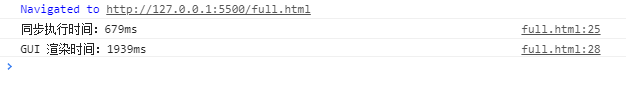
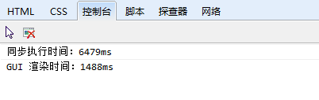
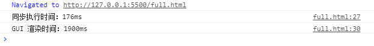
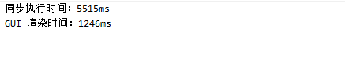

# virtual-scroll-list

本篇文章将围绕**长列表渲染**的**实现**与**优化**，通过图表方式，对比不同实现方式前后的差异，以求更好的渲染形式，主要分以下几个部分：

* [浏览器进程和线程](#EventLoop)
* [全量渲染](#全量渲染)
* [分片渲染](#分片渲染)
* [可视区渲染](#可视区渲染)

## 浏览器进程和线程

长列表渲染是常见的一个开发需求，实现方式有多种，但**效果**展示与**页面性能**会有所不同。谈到性能，需要对浏览器**进程**和**线程**有所了解。下面会简单展开讲解（如果已经有了解，可直接跳过）。

### 进程

进程是 CPU 分配资源的最小单位，同一时间，单个 CPU 只能执行一个任务，运行一个进程。如果一个进程正在执行，其他进程就得暂停。CPU 使用**时间片轮转**算法实现多进程调度。

浏览器（chrome）是多**进程**管理的，主要分为：

* **主进程**
* **每个tab 页为一个进程**
* ***渲染进程***

* **第三方插进程**
* **GPU 进程件**
* **网络进程**

### 线程

线程是 CPU 调度的最小单位，单个进程可包含多线程，共享该进程资源。

渲染进程，即浏览器内核，负责**页面渲染**，**脚本执行**，**事件处理**，每一个 tab 页都有一个渲染进程，且包含多个线程。

渲染进程下的多个**线程**：

* **GUI 渲染线程**
* **JS 引擎线程** 解析执行 JS（单线程），与渲染线程互斥（页面正在渲染一个节点，同时 JS 操作 DOM 又删除了，浏览器就矛盾了，我该删还是渲染呢？）
* **事件触发线程** 维护一个宏任务队列，异步任务（如：setTimeout，AJAX 请求，鼠标点击，requestAnimationFrame）有了结果（或者是满足触发时机），就会通过事件放在宏任务队列中。
* **定时器触发线程**
* **异步 HTTP 请求线程**

> 小提示：由于 JS 单线程，脚本执行中，碰到宏任务（整体脚本、setTimeout、setInterval、setImmediate、I/O 操作、UI 渲染），会放置在 **事件触发线程中**维护一个队列，依次执行同步代码，JS 线程调用栈都清空后，（清空）微任务，**UI 渲染**，取出一个到了触发时机的宏任务执行，再去清空任务，循环往复，形成事件环。

本篇文章涉及到的**列表渲染**时间，处于主栈任务执行完毕之后，拿取下一个宏任务执行之前。衡量页面渲染时间，如果过长，就会导致页面卡顿，白屏，用户体验不好。下面就会从 UI 渲染层面对比三种实现方式的优缺点。

## 全量渲染

一次性将 10 000 条数据渲染到页面中，代码实现：

```html
<ul id='container'></ul>
```

```js
for(let i = 0; i < 100000; i++) {
  let li = document.createElement('li');
  li.innerHTML = i;
  container.appendChild(li);
}
// 记录当前 JS 主栈任务结束时间
const now = Date.now();
// UI 渲染后执行 setTimeout 宏任务
setTimeout(
  function(){ console.red(`%c GUI 渲染时间：%c ${Date.now() - now}ms`)}
);
console.red = function(...args) {
  console.log(...args, 'font-weight: bold;', 'font-weight:bold;color:#f9b')
}
```

打印结果（chrome）：


打印结果（IE 11）：


对比可以看到，IE 浏览器，每改变一次 DOM 列表，就渲染一次，导致时间过长，可进一步优化为 fragment 文档碎片形式：

```js
let start1 = Date.now();
// 创建文档碎片
let fragment = document.createDocumentFragment();
for(let i = 0; i < 100000; i++) {
  let li = document.createElement('li');
  li.textContent = i;
  // 操作文档碎片
  fragment.appendChild(li);
}
// 追加
container.appendChild(fragment);
console.log('同步执行时间：' + (Date.now() - start1) + 'ms')
start1 = Date.now();
setTimeout(
  function(){ console.log('GUI 渲染时间：' +  (Date.now() - start1) + 'ms')}
);
```

打印结果（chrome）：


打印结果（IE 11）：


> 提示：在操作 DOM 时，尽量不要直接在真实 DOM 上进行，可结合文档碎片提高渲染时间。

## 分片渲染

针对全量渲染，有很明显的弊端，就是渲染时间多长，且渲染到页面的节点很多， IE 浏览器白屏时间更长。
结合事件环中，UI 渲染时机，可以分批次放在一个异步任务中执行。

代码实现：

```js

```

## 可视区渲染
